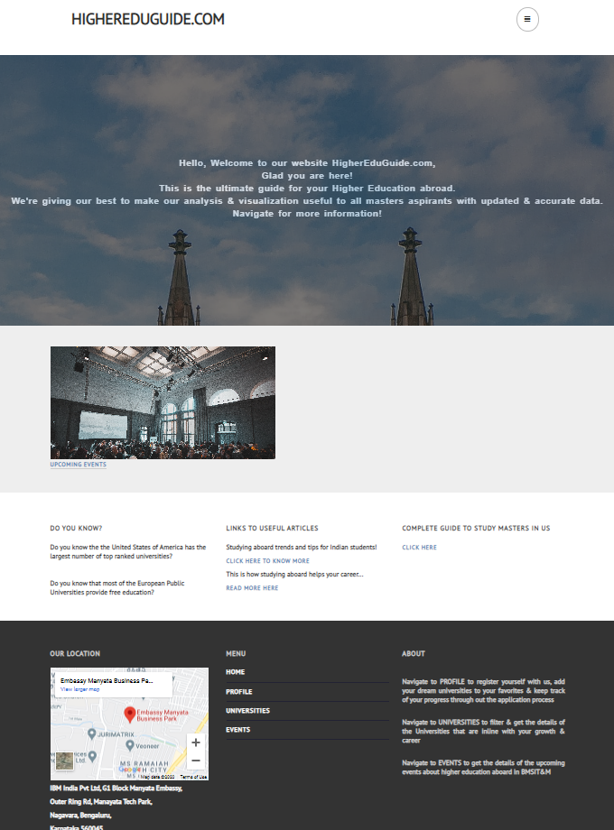
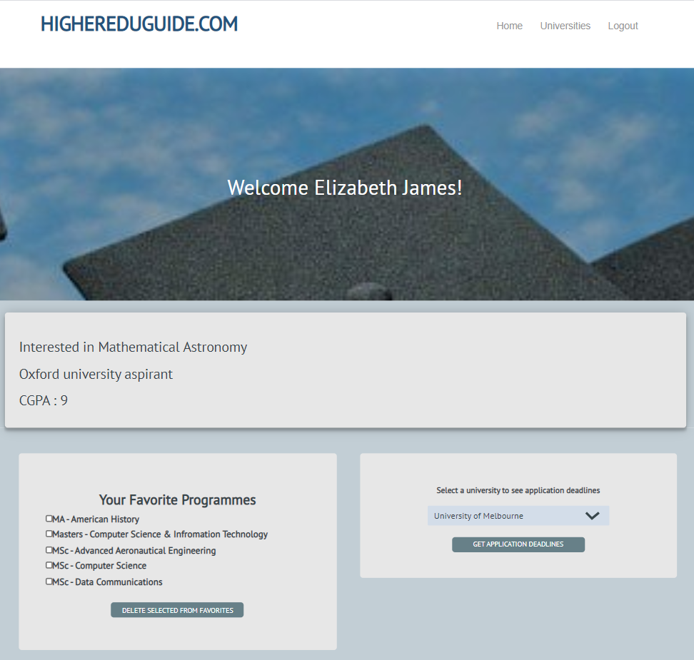
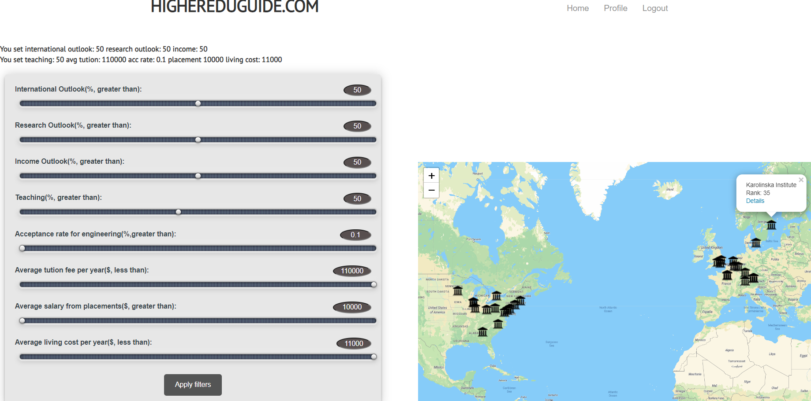
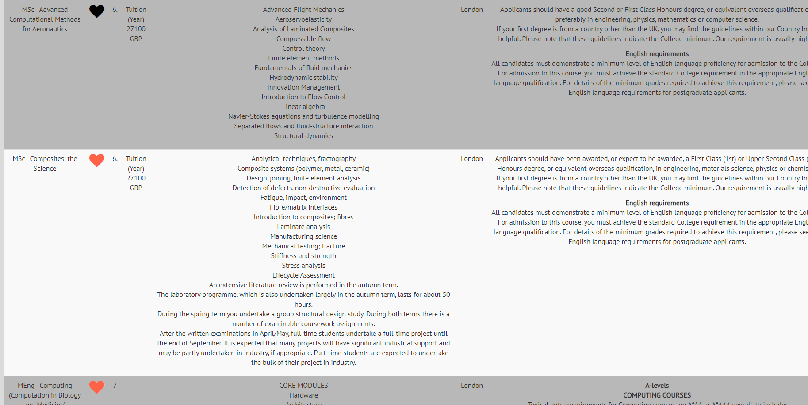

# Higher Education Website

The platform allows users to:

- Search universities
- Explore postgraduate programs
- View course details
- Track upcoming events
- Manage a personal profile and favorite courses

## Tech Stack

- **Frontend**: HTML, CSS, JavaScript
- **Backend**: PHP
- **Database**: MySQL (SQL dump included)

Application screen shots:

- 🏠 **Home Page**
  
- 👤 **Profile Page**
  
- 🏫 **University Search Page**
  
- 📘 **Course Details Page**
  
- 📅 **Upcoming Events Page**
  

## 📂 Project Files Overview

| File                                                | Description                                              |
| --------------------------------------------------- | -------------------------------------------------------- |
| `map.php`                                           | Displays an interactive map of colleges                  |
| `map_form.php`                                      | Contains the college filter form logic                   |
| `college_db.php`                                    | Connects the college ranks table to the app              |
| `masters_pgm_db.php`                                | Loads program details for course display                 |
| `hep_login.php`, `hep_signup.php`, `hep_logout.php` | Authentication flow                                      |
| `profile.php`                                       | Displays user profile details                            |
| `profile_fav.php`                                   | Internal file to add courses to favorites                |
| `profile_fav_delete.php`                            | Deletes favorites from profile                           |
| `hep_home.html`                                     | Home page with navigation links                          |
| `db_connect.php`                                    | Database connection script (used across files)           |
| `sql.zip`                                           | SQL dump for importing into phpMyAdmin _(to be updated)_ |

## Learning Outcomes

This project helped us:

- Understand user-focused design for education portals
- Implement filtering and search functionality using PHP & MySQL
- Reduce code duplication using modular includes (like `db_connect.php`)
- Practice real-world database connection and CRUD operations

## Acknowledgements

This project was created as a mini project for the **17CS77 Web Technology and its applications Lab** ,
7th Semester, B.E. CSE – BMS Institute of Technology & Management, Bengaluru, India

**Team Members:**

1. Merlyn Mercylona Maki Reddy
2. Aishwarya M
